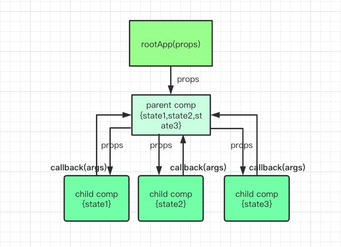
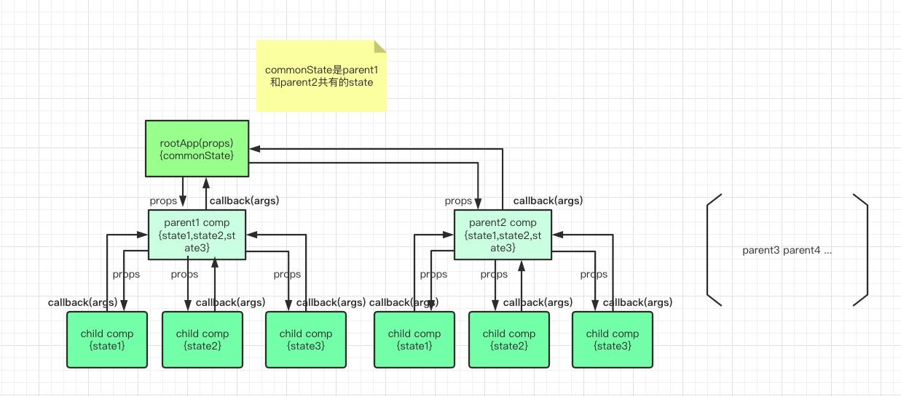
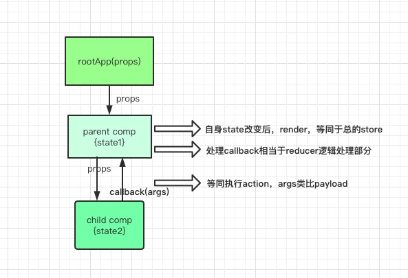
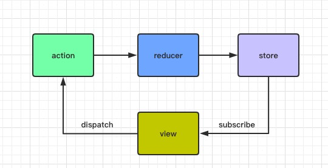
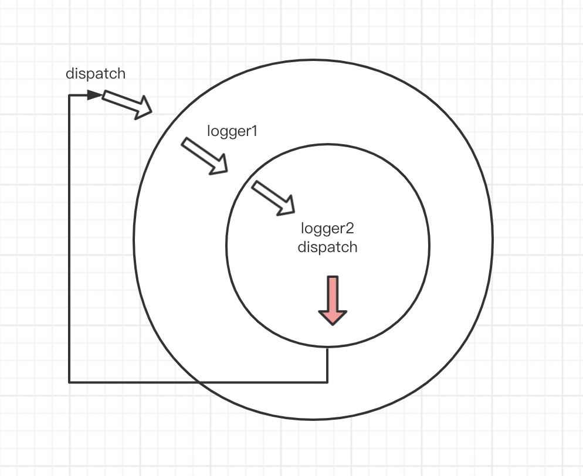

# redux-source-reading
## 1.redux的由来
> * 宏观层面解释：在写复杂多页面UI逻辑或大型项目时 就会出现很多要管理的状态，如果比如最早之前使用jQuery，变量多了，到处都可以修改，用function隔离的有做不到充分共享，其次想要快速定位问题也比较麻烦，因为没有统一管理约束数据流向。目前有很多状态管理库，比如redux，flux，mobx等

> * 具体语言层面解释：react项目里 数据流向是单向的，通过props分发到各个组件中，state负责自身状态管理，想实现数据回流的唯一方式是子组件回调父组件的方法，然后按照契约之行父组件自身的state，然后再通过props流向子组件，那么这样如果有一些相关的子组件都要回流到父组件，父组件又要回流到父组件，这样就会出现顶层state越来越多，此时管理state就显的非常重要，而redux这个库就非常的合适

* 用图来解释react描述为不用redux的情况数据常规流转如下



---
* 当组件多了之后且数据之间相互流转多了之后会是如下这种情况，如下图，可以看出这样层层传递其实多了之后，很多状态都会提升高父级或者父级的父级，当然此时可能你会用到context，这样至少可以避免层层传递props，但是state的管理还是需要放到上层统一管理分发



## 2.redux的核心要素
> * 如何理解redux核心要素 用react数据流转类比



1. state变化后就调用render 等同于整个store含有的订阅监听功能
2. 在父组件callback回调就相当于执行了reducer逻辑处理的部分
3. 在子组件触发callback相当于执行action , args可以类比为payload

>* redux自身的经典数据流转图如下



1. action纯声明式数据结构，只提供事件的要素比如参数或者function名，不提供逻辑
2. reducer匹配函数，action发送是全局的，所有reducer都会收到匹配命中后取出action要素进行逻辑处理，修改state状态并返回新的state
3. store负责状态存储并提供给react api调用等


## 3.redux的核心源码分析
>* 如果自己来实现一个redux需要考虑什么呢？函数自身维护一个state，但不对外暴露，内部可以修改，且可共享，并且可以被其它api调用 思考一下，心里默念3s，其实大概可以描述成下面这个样子
```js
export const createStore = () => { 
    let currentState = {} // 公共状态 
    function getState() {} // getter 
    function dispatch() {} // setter switch case + reducer处理
    function subscribe() {} // 发布订阅模式 这样太麻烦
    return { getState, dispatch, subscribe } 
}
```

>* 源码里是如何实现的呢？就返回一些方法供外部调用

```js
import createStore from './createStore'
import combineReducers from './combineReducers'
import bindActionCreators from './bindActionCreators'
import applyMiddleware from './applyMiddleware'
import compose from './compose'
import __DO_NOT_USE__ActionTypes from './utils/actionTypes'

export {
  createStore,
  combineReducers,
  bindActionCreators,
  applyMiddleware,
  compose,
  __DO_NOT_USE__ActionTypes
}
```

1. combineReducers 先看这个因为它比较简单
    *  比如下面的官方的例子是 添加todo的reducer 这里做个比喻，把state想象为一些规则的几何形状，action理解为改变这些形状的方法，比如生成三角形，四边形规则方法这个就可以看作action的作用
	
```js
import {
  ADD_TODO
} from '../constants/ActionTypes'

const initialState = [
  {
    text: 'Use Redux',
    completed: false,
    id: 0
  }
]

export default function todos(state = initialState, action) {
  switch (action.type) {
    case ADD_TODO:
      return [
        ...state,
        {
          id: state.reduce((maxId, todo) => Math.max(todo.id, maxId), -1) + 1,
          completed: false,
          text: action.text
        }
      ]    
    default:
      return state
  }
}

```
* 此时问题来了，如果又给todo list 添加日志功能, 比如下面的这样，但是添加日志和添加todo 其实是不一样的功能，如果还有更多的reducer操作一个reducer文件会就越来越臃肿，最主这些reducer其实是可以分类 分模块的管理，所以此时combineReducers就可以派上用场了

```js
import {
  ADD_TODO
} from '../constants/ActionTypes'

const initialState = [
  {
    text: 'Use Redux',
    completed: false,
    id: 0
  }
]

export default function todos(state = initialState, action) {
  switch (action.type) {
    case ADD_TODO:
      return [
        ...state,
        {
          id: state.reduce((maxId, todo) => Math.max(todo.id, maxId), -1) + 1,
          completed: false,
          text: action.text
        }
      ]
       break    
    case ADD_LOG:
        return {...state,log:state.log.push({date:new Date})}
        break
    default:
      return state
  }
}
```
* combineReducer的实际常用的例子

```js
    // reducers/index.js
import { combineReducers } from 'redux'
import logReducer from './logReducer'
import todosReducer from './todosReducer'

const rootReducer = combineReducers({
  log: logReducer, // 键名就是该 reducer 对应管理的 state
  todos: todosReducer
})
export default rootReducer


// reducers/todos.js
export default function todosReducer(todos = [], action) { // 传入的 state 其实是 state.todos
  switch (action.type) {
    case 'ADD_LOG':
      return [ ...todos, action.payload ]
    default:
      return todos
  }
}


/* reducers/logReducer.js */
export default function logReducer(log = [], action) { // 传入的 state 其实是 state.log
     log.push({date:new Date})
     return log
}
```

* 这样拆出多个reducer就可以分别管理对应的state，但是因为redux允许app里只有唯一一个store，所以dispatch的时候是会经过所有的reducer的，这也是为什么会要求reducer返回state了，不然其它地方state就获取不到了，提供这个combineReducer其实是建议分而治之state管理


* combineReducers 源码到底做了什么，简单理解就是将所有reducer合并用函数名作为key，key对应的是具体的函数体，执行之前先保存之前的state，与执行之后的state做对比，如果有change就返回新的state，否则返回之前的state，注意这里的return是什么执行的？注释里有说明
```js
function combineReducers(reducers) {
  var reducerKeys = Object.keys(reducers)
  var finalReducers = {}
  
  for (var i = 0; i < reducerKeys.length; i++) {
    var key = reducerKeys[i]
    if (typeof reducers[key] === 'function') {
      finalReducers[key] = reducers[key]
    }
  }

  var finalReducerKeys = Object.keys(finalReducers)

  // return之前就是将reducer的key取出来(这里的key就是state最终对应的值)以及key对应function(就是action)取出来
  // 这里的return什么时候会执行呢？当然是dispatch，创建createStore的时候会默认执行一次，为何要执行一次呢，
  // 目的就是为state赋值初始值，不妨思考一下为何有时候我们项目在入口createStore的时候没有设置默认值，那么默认值是从哪里来的呢？
  // const store = createStore(reducer,applyMiddleware([logger1,logger2]))
  // 答案在createStore函数内部的自调用出发首次dispatch
  // 所以下面的代码就是在所有的reducer中找到合适的key对应的reducer然后执行对应的action同时返回state
  // 不过这里可以看见对比前后state是用的 !==  如果不改变state其实这里也是一个新的
  return function combination(state = {}, action) {
    var hasChanged = false
    var nextState = {}
    for (var i = 0; i < finalReducerKeys.length; i++) {
      var key = finalReducerKeys[i]
      var reducer = finalReducers[key]
      var previousStateForKey = state[key]                       // 获取当前子 state
      var nextStateForKey = reducer(previousStateForKey, action) // 执行各子 reducer 中获取子 nextState
      nextState[key] = nextStateForKey                           // 将子 nextState 挂载到对应的键名
      hasChanged = hasChanged || nextStateForKey !== previousStateForKey
    }
    return hasChanged ? nextState : state
  }
}
```

2. bindActionCreators
>* 这个api 就做了一件事 给actionCreator包装dispatch 备用，可支持传function也可支持传数组对象 源码很清楚明白 注释说明反而显得多余

```js
function bindActionCreator(actionCreator, dispatch) {
  return function() {
    return dispatch(actionCreator.apply(this, arguments))
  }
}

function bindActionCreators(actionCreators, dispatch) {
  if (typeof actionCreators === 'function') {
    return bindActionCreator(actionCreators, dispatch)
  }

  const boundActionCreators = {}
  for (const key in actionCreators) {
    const actionCreator = actionCreators[key]
    if (typeof actionCreator === 'function') {
      boundActionCreators[key] = bindActionCreator(actionCreator, dispatch)
    }
  }
  return boundActionCreators
}
```

3. createStore
>* redux的核心方法 先来一个简化版理解下 感觉就是返回了一些方法  dispatch,subscribe,getState,replaceReducer, 这些方法就是我们用redux经常会用到的方法
```js
export default function createStore(reducer, preloadedState, enhancer) {
  if (typeof preloadedState === 'function' && typeof enhancer === 'undefined') {
    enhancer = preloadedState
    preloadedState = undefined
  }
  if (typeof enhancer !== 'undefined') {
    // 一般会这样调用const store = createStore(reducer,applyMiddleware([logger1,logger2]))
    // return applyMiddleware([logger1,logger2])(createStore)(reducer,preloadedState)
    return enhancer(createStore)(reducer, preloadedState)
  }
  function getState() {
    return currentState
  }
  function subscribe(listener) {
  }

  function dispatch(action) {
  }
  function replaceReducer(nextReducer) {
  }

  function observable() {
  }

  dispatch({ type: ActionTypes.INIT })
  return {
    dispatch,
    subscribe,
    getState,
    replaceReducer,
    [$$observable]: observable
  }
}
```

* createStore 源码分析 详细注释版 12-23行是该方法的重点 这里可以看出核心方法是使用了多个高阶函数嵌套写法，目的其实很明显少写很多代码，同时可以很好的利用闭包特性，代码分析就写在注释里了

```js
import $$observable from 'symbol-observable'
import ActionTypes from './utils/actionTypes'

/**
 * @param  {函数}  reducer
 * @param  {对象}  preloadedState 主要用于前后端同构时的数据同步
 * @param  {函数}  enhancer 大家都叫它增强器，可以实现中间件、时间旅行，持久化等
 * ※ Redux 仅提供 applyMiddleware 这个 Store Enhancer ※
 * @return {Store}
 */
// const store = createStore(reducer, applyMiddleware(logger,logger2))
export default function createStore(reducer, preloadedState, enhancer) {
  if (typeof preloadedState === 'function' && typeof enhancer === 'undefined') {
    enhancer = preloadedState
    preloadedState = undefined
  }

  if (typeof enhancer !== 'undefined') {
    // 这里等同调用return applyMiddleware([logger,logger2])(createStore)(reducer, preloadedState)
    // -> 进入applyMiddleware.js 执行然后又执行createStore const store = createStore(...args) // args就是 reducer, preloadedState
    // 此时的preloadedState = undefined 且enhancer = undefined 所以就会执行到下面的流程
    return enhancer(createStore)(reducer, preloadedState)
  }

  if (typeof reducer !== 'function') {
    throw new Error('Expected the reducer to be a function.')
  }

  let currentReducer = reducer
  let currentState = preloadedState
  let currentListeners = [] // 用于存储订阅的回调函数，dispatch 后逐个执行
  let nextListeners = currentListeners // 为什么会用两个变量来存储 回调队列呢? 为了保证执行队列的时候中途 取消或新增了队列 导致for循环执行会出现跳过的情况
  let isDispatching = false

  // 确保两个队列不干扰
  function ensureCanMutateNextListeners() {
    if (nextListeners === currentListeners) {
      nextListeners = currentListeners.slice()
    }
  }

  function getState() {
    if (isDispatching) {
      throw new Error(
        'You may not call store.getState() while the reducer is executing. ' +
          'The reducer has already received the state as an argument. ' +
          'Pass it down from the top reducer instead of reading it from the store.'
      )
    }

    return currentState
  }

  // 注册订阅的回调 返回值是一个function 执行就会取消当前回调函数的订阅
  function subscribe(listener) {
    if (typeof listener !== 'function') {
      throw new Error('Expected the listener to be a function.')
    }

    if (isDispatching) {
      throw new Error(
        'You may not call store.subscribe() while the reducer is executing. ' +
          'If you would like to be notified after the store has been updated, subscribe from a ' +
          'component and invoke store.getState() in the callback to access the latest state. ' +
          'See https://redux.js.org/api-reference/store#subscribelistener for more details.'
      )
    }

    let isSubscribed = true

    ensureCanMutateNextListeners()
    nextListeners.push(listener)

    return function unsubscribe() {
      if (!isSubscribed) {
        return
      }

      if (isDispatching) {
        throw new Error(
          'You may not unsubscribe from a store listener while the reducer is executing. ' +
            'See https://redux.js.org/api-reference/store#subscribelistener for more details.'
        )
      }

      isSubscribed = false

      ensureCanMutateNextListeners()
      const index = nextListeners.indexOf(listener)
      nextListeners.splice(index, 1) // 注意点：取消订阅还是在 nextListeners 中操作
      currentListeners = null
    }
  }

  // 如果 dispatch 的不是一个对象类型的 action（同步的），而是 Promise / thunk（异步的）
  function dispatch(action) {
    if (isDispatching) {
      throw new Error('Reducers may not dispatch actions.')
    }

    try {
      isDispatching = true // 加锁
      // currentReducer是传进来的reducer函数 就是之前说的combineReducer里的return之后的function
      // 这里是在所有的reducer里找到对应的key然后执行action 最终返回新的state
      currentState = currentReducer(currentState, action)
    } finally {
      isDispatching = false
    }

    const listeners = (currentListeners = nextListeners)
    for (let i = 0; i < listeners.length; i++) {
      // listener[i]() 为什么不这样写呢? 因为this指向不一样
      const listener = listeners[i] // 该中间变量避免了 this 指向 listeners 而造成泄露的问题
      listener()
    }

    // 奇怪返回的还是action这是要做什么呢？ 为了方便链式调用
    return action
  }


  function replaceReducer(nextReducer) {
    if (typeof nextReducer !== 'function') {
      throw new Error('Expected the nextReducer to be a function.')
    }

    currentReducer = nextReducer // 直接替换 感觉这种场景常用于同构跳转页面的时候吧

    dispatch({ type: ActionTypes.REPLACE }) // 然后就立即触发 生成新的state
  }


  function observable() {
    const outerSubscribe = subscribe
    return {
      subscribe(observer) {
        if (typeof observer !== 'object' || observer === null) {
          throw new TypeError('Expected the observer to be an object.')
        }

        function observeState() {
          if (observer.next) {
            observer.next(getState())
          }
        }

        observeState()
        const unsubscribe = outerSubscribe(observeState)
        return { unsubscribe }
      },

      [$$observable]() {
        return this
      }
    }
  }

  // 首次执行dispatch 主要作用是为了赋值每个reducer模块自己的初始值
  dispatch({ type: ActionTypes.INIT })

  return {
    dispatch,
    subscribe,
    getState,
    replaceReducer,
    [$$observable]: observable
  }
}
```

* applyMiddleware 重点
    *  因为上边的createStore返回的其中有一个enhancer(createStore)(reducer,preloadedState) 实际是调用的applyMiddleware([logger,logger2])(createStore)(reducer, preloadedState)
    *  要理解这个函数就先看下中间件的用法 代码如下 也是3个高阶函数嵌套 参数依次是store，next，action 这样在中间件里随处都可以调用store next action了，完美的利用闭包特性与高阶函数简化代码 

    ```js
    const logger = store => next => action => {
        // 一个高阶函数 第一个return 和 第二个return 都是在applyMiddleware.js里调用的
        // 第一处是const chain = middlewares.map(middleware => middleware(middlewareAPI))
        // 第二处是dispatch = compose(...chain)(store.dispatch)
        let result = next(action)  // result的结果是什么呢？中间件最终返回的是result结果
        console.log('next state', store.getState())
        return result
    }

    ```
    * 接下来来看源码中的applyMiddleware.js 同样这里还是利用了多个高阶函数以及闭包 核心要理解每个return是在什么时候返回的

    ```js
    import compose from './compose'
    // 调用方式是 applyMiddleware(logger,logger2)
    export default function applyMiddleware(...middlewares) { 
    // ...middlewares=> [logger1,logger2]
        return function (createStore ) {
                return function (...args){ // args 就是[reducer,preloadedState]
                const store = createStore(...args) // 返回值是 {dispatch,subscribe,getState,replaceReducer...}
                let dispatch = () => {
                    throw new Error(
                    'Dispatching while constructing your middleware is not allowed. ' +
                        'Other middleware would not be applied to this dispatch.'
                    )
                }
                const middlewareAPI = {
                    getState: store.getState,
                    dispatch: (...args) => dispatch(...args) // 这句代码乍一看很shit,实际...
                }
                // logger1 =  store => next => action => { let result = next(action) return result;} 这里的store就是传进来的middlewareAPI
                // chain = [(next) => action => { let result = next(action) return result;} , (next) => action => { let result = next(action) return result;}]
                const chain = middlewares.map(middleware => middleware(middlewareAPI))

                // compose([a,b,c])(store.dispatch) ->  a(b(c(store.dispatch)))
                // dispatch = compose(logger1(middlewareAPI),logger2(middlewareAPI))(store.dispatch)
                // 最终执行的代码是a(args)-> logger1(middlewareAPI)(result) // result -> logger2的返回值 logger2(middlewareAPI)(store.dispatch){ return action=> next(action);
                // next其实就是store.dispatch 该函数定义是 (...args) => dispatch(...args)}
                dispatch = compose(...chain)(store.dispatch) // 依然是高阶函数

                // 所以applyMiddleware就是在dispatch action过程中一直传递action信息 并且串联的执行中间件函数 可以认为是用中间件的dispatch覆盖了原来的dispatch
                // 而这个才是 index.js代码中真正返回的store const store = createStore(reducer, applyMiddleware(logger,logger2))
                // 所以如果抛开react-redux来说的话，代码中直接调用dispatch来触发action就可以了 此时的dispatch就是被增强过的，
                // 但是我们发现为何使用了react-redux我们就很少见到dispatch呢，它到底是在哪里被调用的呢？
                    return {
                        ...store,
                        dispatch
                        // 返回值这里是将store原本的dispatch改写了，这也是中间件的核心要做的事，如果没用使用中间件其实就不会改写dispatch
                        // 改写的目的主要是可以方便的让action或者state流转到所有中间件（洋葱模型）
                        // 问题 如果在中间件中发送一个dispatch会怎么样呢？
                        }
                }
            }
    }
    ```

	*  一个小问题如果是在中间件中在进行dispatch会怎么样呢？ 如下图会出现死循环如果不加条件的话
    
* compose.js源码分析 代码开头的英文注释写的很清楚，不明白直接看注释例子用法 就是利用reduce来实现函数嵌套，也叫做科里化

```js
/**
 * Composes single-argument functions from right to left. The rightmost
 * function can take multiple arguments as it provides the signature for
 * the resulting composite function.
 *
 * @param {...Function} funcs The functions to compose.
 * @returns {Function} A function obtained by composing the argument functions
 * from right to left. For example, compose(f, g, h) is identical to doing
 * (...args) => f(g(h(...args))).
 */

export default function compose(...funcs) {
  if (funcs.length === 0) {
    return arg => arg
  }

  if (funcs.length === 1) {
    return funcs[0]
  }
  //
  return funcs.reduce((a, b) => (...args) => a(b(...args)))
}
// 举个栗子: compose([a,b,c])(store.dispatch) ->  a(b(c(store.dispatch)))

```
* redux-thunk分析 处理异步方式的  准确的说是处理action为function类型的 源码也很少，主要是做了兼容function类型达到后续可执行

```js
function createThunkMiddleware(extraArgument) {
  return ({ dispatch, getState }) => (next) => (action) => {
    if (typeof action === 'function') {
        // 重点就在这里 就是对action为函数时再次调用action同时将dispatch, getState, extraArgument 传递 这样就进入了外部的action逻辑了
        // 为什么要单独处理action为function类型呢，因为redux里没有对action为function类型的处理action类型只处理了对象
      return action(dispatch, getState, extraArgument);
    }
    return next(action);
  };
}

const thunk = createThunkMiddleware();
thunk.withExtraArgument = createThunkMiddleware;

export default thunk;

// 调用的栗子说明
export const addTodo = text => {
    // 注意function第一个参数 是一个dispatch
  return dispatch => {
    setTimeout(() => {
      dispatch({
        type: types.INCREMENT_COUNTER,
        text
      });
    }, 1000);
  };
}

// 原来是这样调用的
export const addTodo = text => ({ type: types.INCREMENT_COUNTER, text })
```

* redux-promise 处理action为promise类型的 

```js
import isPromise from 'is-promise';
import { isFSA } from 'flux-standard-action';

export default function promiseMiddleware({ dispatch }) {
  return next => action => {
    if (!isFSA(action)) {
        // 这里的dispatch还是要传递的
      return isPromise(action) ? action.then(dispatch) : next(action);
    }

    //这里有关于promise类型判断 是否有兴趣 了解下呢？
    return isPromise(action.payload)
      ? action.payload
          .then(result => dispatch({ ...action, payload: result }))
          .catch(error => {
            dispatch({ ...action, payload: error, error: true });
            return Promise.reject(error);
          })
      : next(action);
  };
}

```

## 总结
* 通过对redux的思想演进，带入源码分析
* 先分析了combineReducers.js该函数主要是将state的操作分而治之的分散到各个reducer文件中，实现模块化管理思想，从而达到便于管理维护，这里对于reducer可以简单理解为实际改变state的具体方法
* 然后分析了bindActionCreators，这个就是简单的将actionCreators进行包装，便于调用，仅此而已
* 再然后重点分析createStore，最重要是返回值store，而store里包含的dispatch,    subscribe,    getState,    replaceReducer，就是一个简单的订阅发布模式
* 之后就进入applyMiddleware，这里的重点是如果有中间件，那么调用的store里的dispatch其实是被改写过的，目的是在dispatch的时候action会依次经过所有中间件作为参数，同时链式调用直至完成
* 最后如果action为function一般常用于处理异步这种方式，一般用到redux-thunk，源码也就是对action判断function类型做了下处理，如果是action为promise类型就会用到对应的redux-promise
* 一般react项目里用到redux时就会用到react-redux，react-redux原理分析下期待下一篇，后续会对redux-sage 以及redux-dva原理做系列解读

## 读源码收获
* 首先是更加熟悉该框架api最佳使用姿势
* 其次是体会到了某些基础语法的巧妙利用比如高阶函数+闭包 就可以放大招（简化代码，可读性减弱）
* 学习大神的编程技巧以及思考方式等
